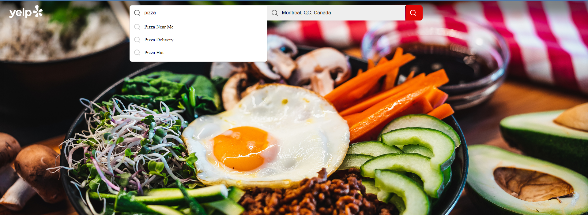
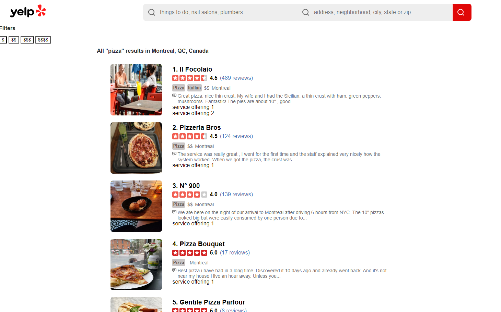

# Yelp Clone Web Application

This is a work-in-progress project in which I'm recreating Yelp's website using Django and Python, with plans to add new features such as time-based review score plots.

## Requirements

This project requires API keys for both the Yelp Fusion API and the Google Places API. You can register for these keys at the following links:

* [Yelp Fusion API](https://docs.developer.yelp.com/docs/fusion-authentication)
* [Google Places API](https://developers.google.com/maps/documentation/places/web-service/get-api-key)

These keys are essential for accessing the data and functionalities of the respective services.

## Installation

First, clone this repository:
```
git clone https://github.com/Kay1San/YelpFusion-API.git
``` 

Once cloned, install the following dependencies:

``` 
pip install django
pip install python-dotenv
pip install requests
``` 

Generate a Django SECRET_KEY with this command:
```
python -c 'from django.core.management.utils import get_random_secret_key; print(get_random_secret_key())'
``` 

Create a .env file in the root directory of the app, following the instructions in example.env.

Then, apply the migrations:

```
python manage.py migrate
```

## Instructions

Run the app locally with:
```
python manage.py runserver
```

Here's a preview of the home page, featuring the autocomplete packages from @trevoreyre:



The search results page is still in development, with more filter options to be added soon:


## Documentations

* [Django Documentation](https://docs.djangoproject.com/en/5.0/)
* [Yelp Fusion Documentation](https://docs.developer.yelp.com/docs/fusion-intro)
* [Google Places Documentation](https://developers.google.com/maps/documentation/places/web-service/overview)
* [Autocomplete package](https://autocomplete.trevoreyre.com/#/)


